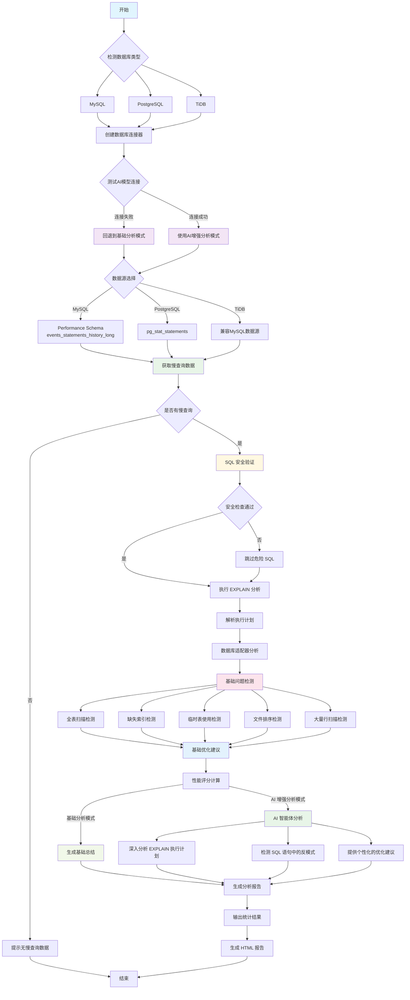

# Database AI Agent System

一个基于多Agent架构的智能数据库管理和分析系统，提供跨数据库查询分析、性能监控、智能优化建议等全方位的数据库管理解决方案。

## 🚀 核心功能

### 🔍 跨数据库查询分析
- **智能查询解析**: 自动识别跨数据库查询并分析性能影响
- **依赖关系可视化**: 生成数据库间依赖关系图谱
- **性能瓶颈识别**: 精确定位跨库查询的性能瓶颈
- **优化建议生成**: 基于分析结果提供个性化优化建议

### 🤖 多Agent协作架构
- **智能任务分配**: 自动将复杂任务分解并分配给专业Agent
- **协调器管理**: 统一协调多个Agent的工作流程
- **上下文隔离**: 确保不同Agent间的独立性和数据安全
- **结果融合**: 智能合并多个Agent的分析结果

### 📊 实时性能监控
- **跨数据库事务监控**: 实时监控跨库事务的性能指标
- **智能告警系统**: 基于可配置规则的性能告警
- **可视化仪表板**: 直观展示数据库性能趋势
- **历史数据分析**: 提供性能历史趋势分析

### 🎯 智能优化引擎
- **分布式查询优化**: 针对跨数据库查询的专业优化策略
- **自动索引建议**: 基于查询模式的智能索引推荐
- **查询重写**: 提供优化后的SQL重构方案
- **性能预测**: 预估优化后的性能改进效果

### 🗄️ 多数据库支持
- **MySQL**: 完整支持包括性能监控和优化建议
- **PostgreSQL**: 原生支持PostgreSQL特有功能
- **TiDB**: 分布式数据库优化支持
- **SQL Server**: 企业级数据库管理
- **Oracle**: 大型企业数据库支持
- **SQLite**: 轻量级数据库支持

## 🛡️ 安全特性

工具会对抓取到的慢 SQL 自动执行 EXPLAIN 执行计划分析，为确保数据操作安全性，因此特别添加如下安全增强手段：

### 1. 输入验证增强

- **空值检查**: 防止空或无效 SQL 语句
- **长度限制**: 防止过大 SQL 语句攻击
- **格式验证**: 使用 sqlparse 进行 SQL 语法验证

### 2. SQL 危险操作检测

- **关键字黑名单**: 检测 DROP, DELETE, UPDATE, INSERT 等危险操作
- **多语句检测**: 防止通过分号注入多条 SQL 语句
- **操作限制**: EXPLAIN 功能只允许 SELECT 语句

### 3. 数据隐私保护

- **本地处理**: Ollama 模式下，所有数据处理在本地完成，不上传到云端

## 🚀 三种分析模式

本工具提供了三种不同的分析模式，使用者可根据环境和需求灵活选择：

### 🔧 基础分析模式 (无需 AI)

当未使用任何 AI 配置时，工具使用规则引擎进行快速分析：

- ⚡ **执行计划分析**: 全面解读数据库 EXPLAIN 执行计划
- 🚨 **性能问题检测**: 自动识别全表扫描、索引缺失、临时表等常见性能问题
- 📊 **性能评分**: 基于规则算法计算查询性能评分（0-100 分）
- 💡 **基础优化建议**: 基于检测问题提供结构化的优化建议
- 📋 **详细报告**: 生成包含执行计划和问题分析的基础报告
- ⚡ **极速响应**: 基于规则引擎快速返回分析结果，极速响应无延迟

### 🤖 云端 AI 增强分析模式

当配置了云端模型API密钥时，使用云端模型进行深度分析：

- 🧠 **智能深度分析**: 基于大语言模型的高级 SQL 性能分析
- 🔍 **上下文理解**: AI 理解查询意图和业务逻辑，提供更精准的分析
- 💬 **自然语言解释**: 用易懂的中文解释复杂的性能问题
- 💡 **高级优化建议**: 基于 AI 模型，提供更专业、更具体的优化策略
- 🎯 **SQL重构示例**: 提供优化后的 SQL 重构示例代码
- 📈 **影响评估**: 预测优化后的性能改进效果

### 🦙 Ollama 本地分析模式 

当配置了 Ollama 本地模型时，使用本地大模型进行分析：

- 🔒 **数据隐私**: 所有数据在本地处理，无需上传到云端
- ⚡ **快速响应**: 本地推理，无网络延迟
- 💰 **零成本**: 无 API 调用费用，完全免费使用
- 📡 **离线运行**: 支持完全离线环境下的 SQL 性能分析

### 分析模式对比

| 特性         | 基础分析模式           | 云端 AI 增强分析模式         | Ollama 本地分析模式        |
| ------------ | ---------------------- | ----------------------- | ------------------------ |
| **环境要求** | 无需使用AI          | 需要 API 密钥    | 需要 Ollama 本地模型     |
| **分析速度** | 非常快                   | 有推理延迟                | 取决于本地硬件条件           |
| **分析深度** | 规则驱动，覆盖常见问题 | 先进模型深度理解上下文 | 取决于本地模型的推理能力     |
| **建议质量** | 结构化，仅基于执行计划结果 | 个性化，考虑具体场景和行业最佳实践    | 个性化，考虑具体场景和行业最佳实践 |
| **成本**     | 免费                   | 需要 API 调用费用       | 免费                     |
| **适用场景** | 快速诊断，批量分析     | 深度优化，复杂查询分析  | 日常 SQL 分析            |

## 📦 安装说明

### 系统要求

- Python 3.9 或更高版本
- 支持的操作系统：Windows、macOS、Linux

### 快速安装

#### 方法一：使用安装脚本（推荐）

```bash
# 克隆项目
git clone https://github.com/jamesfeng2009/database-ai-agent.git
cd database-ai-agent

# 运行安装脚本
python install_dependencies.py
```

#### 方法二：使用 pip 安装

```bash
# 克隆项目
git clone https://github.com/jamesfeng2009/database-ai-agent.git
cd database-ai-agent

# 创建虚拟环境（推荐）
python -m venv database_ai_agent_env
source database_ai_agent_env/bin/activate  # Linux/Mac
# 或
database_ai_agent_env\Scripts\activate     # Windows

# 安装依赖
pip install -r requirements.txt
```

#### 方法三：使用 pyproject.toml

```bash
# 从项目根目录安装
pip install -e .
```

### 验证安装

```bash
# 运行安装验证
python install_dependencies.py

# 或手动验证关键模块
python -c "import pydantic, dotenv, aiomysql, asyncpg, httpx, openai; print('✅ 安装成功')"
```

## 🏗️ 技术特色

### 多Agent协作架构
- **模块化设计**: 每个Agent专注于特定领域的专业分析
- **异步处理**: 全面采用async/await模式，支持高并发操作
- **智能调度**: 基于任务复杂度和Agent能力的智能任务分配
- **容错机制**: 内置故障检测和自动恢复机制

### 跨数据库分析引擎
- **SQL解析**: 智能识别跨数据库查询中的表引用和依赖关系
- **性能建模**: 基于网络延迟、数据传输量等因素的性能预测模型
- **优化策略**: 支持谓词下推、连接重排序、并行执行等多种优化策略
- **可视化展示**: 生成数据库依赖关系图和性能分析报告

### 实时监控系统
- **事务追踪**: 实时监控跨数据库事务的执行状态
- **性能指标**: 收集CPU、内存、网络、锁等多维度性能数据
- **智能告警**: 基于机器学习的异常检测和预警机制
- **历史分析**: 提供性能趋势分析和容量规划建议

## 🗄️ 支持的数据库

### MySQL
- **连接方式**: 异步连接 (aiomysql)
- **慢查询来源**: performance_schema.events_statements_history_long
- **执行计划**: EXPLAIN FORMAT=JSON
- **优化建议**: MySQL 特定的索引和查询优化

### PostgreSQL
- **连接方式**: 异步连接 (asyncpg)
- **慢查询来源**: pg_stat_statements
- **执行计划**: EXPLAIN (ANALYZE, BUFFERS, FORMAT JSON)
- **优化建议**: PostgreSQL 特定的顺序扫描和索引优化

### TiDB
- **连接方式**: 兼容 MySQL 连接器
- **慢查询来源**: 兼容 MySQL performance_schema
- **执行计划**: 兼容 MySQL EXPLAIN
- **优化建议**: TiDB 特定的分布式优化建议

## 📁 项目架构

```
database-ai-agent/
├── src/sql_analyzer/
│   ├── agent_core/                    # 多Agent核心架构
│   │   ├── agents/                    # 专业化Agent实现
│   │   │   ├── base_agent.py         # Agent基类
│   │   │   ├── coordinator_agent.py  # 协调器Agent
│   │   │   ├── knowledge_agent.py    # 知识管理Agent
│   │   │   ├── memory_agent.py       # 记忆管理Agent
│   │   │   ├── nlp_agent.py          # 自然语言处理Agent
│   │   │   └── sql_analysis_agent.py # SQL分析Agent
│   │   ├── communication/            # Agent间通信
│   │   │   ├── a2a_protocol.py       # Agent-to-Agent协议
│   │   │   └── event_system.py       # 事件系统
│   │   ├── management/               # 管理和协调
│   │   │   ├── agent_orchestrator.py # Agent编排器
│   │   │   ├── intelligent_workflows.py # 智能工作流
│   │   │   └── multi_agent_system.py # 多Agent系统
│   │   └── services/                 # 核心服务
│   │       ├── auto_optimizer.py     # 自动优化器
│   │       ├── safety_validator.py   # 安全验证器
│   │       └── sql_integration.py    # SQL集成服务
│   ├── database/                     # 数据库抽象层
│   │   ├── cross_database_analyzer.py # 跨数据库分析器
│   │   ├── cross_database_monitor.py  # 跨数据库监控器
│   │   ├── distributed_query_optimizer.py # 分布式查询优化器
│   │   ├── database_manager.py       # 数据库管理器
│   │   ├── connection_manager.py     # 连接管理器
│   │   └── adapters.py              # 数据库适配器
│   ├── dashboard/                    # 可视化仪表板
│   │   ├── dashboard_manager.py      # 仪表板管理器
│   │   ├── cross_database_visualizer.py # 跨数据库可视化
│   │   └── metrics_collector.py     # 指标收集器
│   └── nlp/                         # 自然语言处理
│       ├── processor.py             # NLP处理器
│       ├── intent_classifier.py     # 意图分类器
│       └── entity_extractor.py      # 实体提取器
├── docs/                            # 技术文档
├── examples/                        # 使用示例
├── pyproject.toml                   # 项目配置
└── README.md
```

## 🔄 工具运作流程

下图展示了工具的完整运作原理和核心流程：




#### 基础分析模式的规则引擎原理

规则引擎会从MySQL EXPLAIN 执行计划中基于规则自动匹配常见性能缺陷并评估问题严重等级，可识别的常见问题如下：

1. **全表扫描 (Critical/High)**

   - 检测 `type=ALL` 的查询
   - 根据扫描行数评估严重程度

2. **缺失索引 (High)**

   - 检测有可用索引但未使用的情况
   - 分析 `possible_keys` 和 `key` 字段

3. **临时表使用 (Medium)**

   - 检测 `Using temporary` 操作
   - 增加内存使用和磁盘 I/O，影响查询性能

4. **文件排序 (Medium)**

   - 检测 `Using filesort` 操作
   - 无法使用索引排序，需要额外的排序开销

5. **大量行扫描 (High)**
   - 检测扫描行数过多的查询
   - 可配置阈值

### 性能评分算法

评分基于以下因素：

- 基础分数：100 分
- 问题严重程度扣分：
  - Critical: -30 分
  - High: -20 分
  - Medium: -10 分
  - Low: -5 分
- 扫描行数扣分：
  - 大于 10 万行: -20 分
  - 大于 1 万行: -10 分
  - 大于 1 千行: -1 分

最终评分范围：0-100 分


## 🛠️ 安装和配置

### 1. 基础安装
推荐使用 uv 管理项目依赖

```bash
# 如果没有uv，需要安装
pip install uv

# 创建虚拟环境
uv venv

# 激活虚拟环境
.venv\Scripts\activate

# 安装依赖
uv pip install .
```

### 2. 环境配置

工具支持多种配置方式，在.env中配置，可根据需要选择合适的 AI 分析模式：

#### 选项一：Ollama 本地模式


```bash
# Ollama 模型名称（必填）
OLLAMA_MODEL=deepseek-r1:1.5b

# Ollama API 基础 URL（可选，默认: http://localhost:11434）
OLLAMA_BASE_URL=http://localhost:11434

# 请求超时时间，单位秒（可选，默认: 60.0）
OLLAMA_TIMEOUT=120.0

# 是否启用流式响应（可选，默认: false）
# 使用深度思考模型时强烈建议开启此选项，否则可能超时报错
OLLAMA_STREAM=false
```

#### 选项二：云端 AI 模式

```bash
# OpenAI API 密钥（必填）
OPENAI_API_KEY=your_openai_api_key_here

# 模型名称（必填）
# 目前暂不建议使用deepseek-reasoner，后续会支持
OPENAI_MODEL=deepseek-chat

# API 基础 URL（可选，用于自定义端点）
OPENAI_BASE_URL=https://api.deepseek.com

# 请求超时时间，单位秒（可选，默认: 60.0）
OPENAI_TIMEOUT=60.0

# 最大重试次数（可选，默认: 3）
OPENAI_MAX_RETRIES=3
```

#### 选项三：仅基础分析模式

无需配置AI即可使用基础分析功能。

#### 数据库配置

```bash
MYSQL_HOST="127.0.0.1"
MYSQL_PORT="3306"
MYSQL_USER="username"
MYSQL_PASSWORD="password"
MYSQL_DATABASE="test"

#可选配置
MYSQL_SLOW_THRESHOLD="1"    # 慢查询时间阈值（秒）
MYSQL_ROWS_THRESHOLD="10000"   # 扫描行数阈值
MYSQL_SLOW_LIMIT="3"         # 分析的慢查询数量限制
```

### 3. 启用Performance Schema

```sql
-- 检查状态
SHOW VARIABLES LIKE 'performance_schema';

-- 如果显示 OFF，需要在 my.cnf 中启用并重启 MySQL
[mysqld]
performance_schema=ON
```

```sql
-- 检查 performance_schema的消费者是否开启
SELECT * FROM performance_schema.setup_consumers WHERE NAME = 'events_statements_history_long';

-- 如果 ENABLED 显示 NO，需要启用
UPDATE performance_schema.setup_consumers SET ENABLED = 'YES' WHERE NAME = 'events_statements_history_long';
```

### 4. 快速开始

#### 基础SQL分析
```bash
# 运行传统的慢查询分析
python app.py
```

#### 跨数据库查询分析
```python
from src.sql_analyzer.database.database_manager import DatabaseManager
from src.sql_analyzer.database.cross_database_analyzer import CrossDatabaseAnalyzer

# 初始化数据库管理器
db_manager = DatabaseManager()
cross_db_analyzer = CrossDatabaseAnalyzer(db_manager)

# 分析跨数据库查询
sql = """
SELECT u.name, o.total_amount, p.product_name
FROM ecommerce_db.users u
JOIN analytics_db.orders o ON u.id = o.user_id
JOIN inventory_db.products p ON o.product_id = p.id
WHERE o.order_date >= '2024-01-01'
"""

# 执行分析
query_analysis = await cross_db_analyzer.analyze_cross_database_query(sql)
performance_impact = await cross_db_analyzer.analyze_performance_impact(query_analysis)

print(f"查询类型: {query_analysis.query_type}")
print(f"涉及数据库: {len(query_analysis.involved_databases)}")
print(f"估算成本: {query_analysis.estimated_cost}")
print(f"优化建议: {query_analysis.optimization_suggestions}")
```

#### 启动监控仪表板
```python
# 运行跨数据库监控演示
python demo_cross_database_analysis.py
```

### MySQL 慢查询数据源

工具支持多种慢查询数据源：

#### 1. Performance Schema（推荐）

从 MySQL 的 `performance_schema.events_statements_history_long` 表读取慢查询数据：

```sql
SELECT
            TIMER_WAIT / 1000000000000 as query_time,
            LOCK_TIME / 1000000000000 as lock_time,
            ROWS_SENT as rows_sent,
            ROWS_EXAMINED as rows_examined,
            SQL_TEXT as sql_statement,
            TIMER_START / 1000000000000 as timestamp_micro,
            SUBSTRING_INDEX(USER(), '@', 1) as user,
            SUBSTRING_INDEX(USER(), '@', -1) as host,
            CURRENT_SCHEMA as database_name
        FROM performance_schema.events_statements_history_long
        WHERE TIMER_WAIT / 1000000000000 >= 1
        AND ROWS_EXAMINED >= 1000
        AND SQL_TEXT IS NOT NULL
        AND SQL_TEXT NOT LIKE 'SHOW%'
        AND SQL_TEXT NOT LIKE 'EXPLAIN%'
        ORDER BY TIMER_WAIT DESC
        LIMIT 3
```

#### 2. 进程列表回退

如果 Performance Schema 不可用，工具会自动回退到使用 `INFORMATION_SCHEMA.PROCESSLIST`：

```sql
SELECT
    ID,
    USER,
    HOST,
    DB,
    COMMAND,
    TIME,
    STATE,
    INFO
FROM INFORMATION_SCHEMA.PROCESSLIST
WHERE COMMAND = 'Query'
AND TIME >= 1.0
AND INFO IS NOT NULL
ORDER BY TIME DESC
```

备注：information_schema.processlist 是 MySQL 中一个系统视图，用于展示**当前**服务器中所有正在运行的线程信息

#### 3. 日志文件读取（计划中）

未来版本将支持直接从慢查询日志文件读取数据。

### 常见问题

**Q: 为什么没有检测到慢查询？**
A: 请检查：

- Performance Schema 是否启用
- 慢查询阈值设置是否合理（包括时间、扫描行数）

**Q: 云端 AI 分析功能无法使用？**
A: 请检查：

- OPENAI_API_KEY 是否正确设置
- 网络连接是否正常
- API 密钥是否有足够的额度

**Q: 如何使用跨数据库分析功能？**
A: 跨数据库分析是本系统的核心功能：

- ✅ 自动识别跨数据库查询
- ✅ 分析数据库间依赖关系
- ✅ 生成性能影响评估报告
- ✅ 提供分布式查询优化建议
- ✅ 实时监控跨数据库事务

**Q: 多Agent系统如何工作？**
A: 系统采用专业化Agent协作模式：

- 🤖 **协调器Agent**: 负责任务分解和结果整合
- 🧠 **知识管理Agent**: 管理数据库优化知识库
- 💾 **记忆管理Agent**: 处理历史分析数据和用户偏好
- 🔍 **SQL分析Agent**: 专门负责SQL性能分析
- 📊 **监控Agent**: 实时收集和分析性能指标

## 📚 相关文档

- [跨数据库分析实现详解](CROSS_DATABASE_ANALYSIS_IMPLEMENTATION.md)
- [多Agent协作架构](MULTI_AGENT_COLLABORATION_SUMMARY.md)
- [智能工作流系统](INTELLIGENT_WORKFLOWS_SUMMARY.md)
- [仪表板实现指南](DASHBOARD_IMPLEMENTATION_SUMMARY.md)
- [高级记忆架构](MEMORY_ARCHITECTURE_SUMMARY.md)

## 🤝 贡献指南

欢迎提交Issue和Pull Request来帮助改进项目！

## 📄 许可证

本项目采用 MIT 许可证 - 查看 [LICENSE](LICENSE) 文件了解详情。


