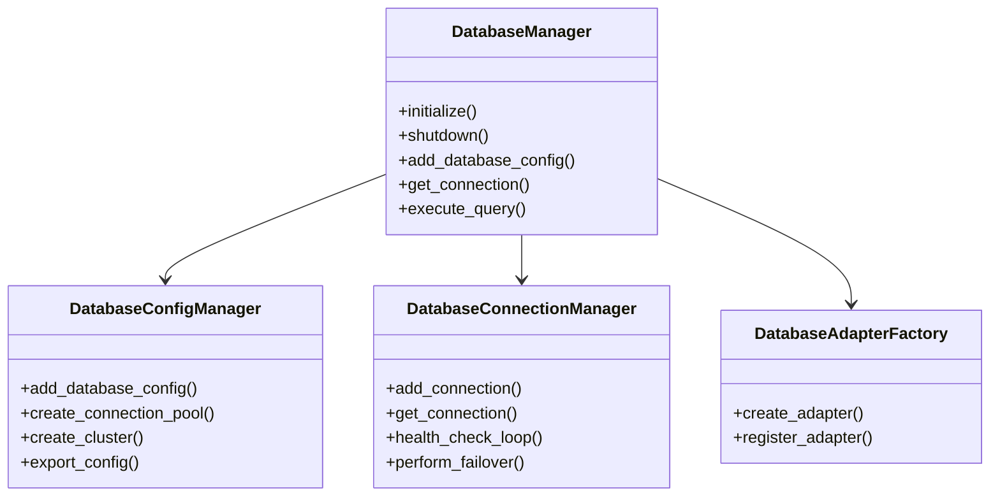

# 数据库适配器架构扩展

## 概述

本文档描述了数据库适配器架构的扩展实现，包括多数据库支持、动态连接管理、负载均衡、故障转移和统一配置管理等功能。

## 功能特性

### 1. 多数据库类型支持

扩展后的系统支持以下数据库类型：

- **MySQL** - 完整支持，包括慢查询分析
- **PostgreSQL** - 完整支持，包括JSON格式EXPLAIN解析
- **TiDB** - 基于MySQL协议，支持分布式特性
- **MariaDB** - 基于MySQL协议，支持列存储引擎
- **Oracle** - 基础支持（需要额外依赖）
- **SQL Server** - 基础支持（需要额外依赖）
- **SQLite** - 完整支持，适用于开发和测试
- **MongoDB** - 预留支持（未实现）
- **Redis** - 预留支持（未实现）

### 2. 动态连接管理

#### 连接池管理
- 支持多数据库连接池
- 动态添加/移除连接
- 连接权重配置
- 连接使用统计

#### 负载均衡策略
- **轮询（Round Robin）** - 依次使用每个连接
- **最少连接（Least Connections）** - 选择连接数最少的数据库
- **加权轮询（Weighted Round Robin）** - 根据权重分配连接
- **健康状态优先（Health Based）** - 优先选择响应时间最短的连接

### 3. 健康检查和故障转移

#### 健康检查机制
- 定期执行连接测试（默认30秒间隔）
- 响应时间监控
- 连续失败次数统计
- 连接状态分类：健康、降级、不健康、断开

#### 故障转移
- 自动检测连接故障
- 主从切换支持
- 故障恢复后自动重新集成
- 断路器模式防止级联故障

### 4. 统一配置管理

#### 配置类型
- **单数据库配置** - 独立的数据库连接配置
- **连接池配置** - 多数据库的池化管理
- **集群配置** - 主从架构的集群管理

#### 配置管理功能
- JSON格式配置文件
- 配置的增删改查
- 配置导入导出
- 配置验证和测试

## 架构设计

### 核心组件

```
DatabaseManager (统一管理接口)
├── DatabaseConfigManager (配置管理)
├── DatabaseConnectionManager (连接管理)
└── DatabaseAdapterFactory (适配器工厂)
```

### 类图关系



## 使用指南

### 基本使用

```python
from src.sql_analyzer.database import DatabaseManager, MySQLConfig

# 创建数据库管理器
db_manager = DatabaseManager("config.json")

# 添加数据库配置
mysql_config = MySQLConfig(
    host="localhost",
    port=3306,
    user="root",
    password="password",
    database="test_db"
)
db_manager.add_database_config("mysql_primary", mysql_config)

# 初始化管理器
await db_manager.initialize()

# 获取连接并执行查询
connection = await db_manager.get_connection()
result = await connection.execute_query("SELECT * FROM users")

# 关闭管理器
await db_manager.shutdown()
```

### 连接池配置

```python
# 创建连接池
success = db_manager.config_manager.create_connection_pool(
    pool_id="mysql_cluster",
    config_ids=["mysql_node_1", "mysql_node_2", "mysql_node_3"],
    strategy=LoadBalancingStrategy.ROUND_ROBIN,
    max_connections_per_db=20,
    health_check_interval=30
)
```

### 集群配置

```python
# 创建主从集群
success = db_manager.config_manager.create_cluster(
    cluster_id="mysql_cluster",
    cluster_name="MySQL主从集群",
    primary_config_id="mysql_primary",
    replica_config_ids=["mysql_replica_1", "mysql_replica_2"],
    read_write_split=True,
    auto_failover=True
)

# 获取集群连接
read_connection = await db_manager.get_cluster_connection("mysql_cluster", read_only=True)
write_connection = await db_manager.get_cluster_connection("mysql_cluster", read_only=False)
```

### 健康监控

```python
# 获取连接状态
connection_status = db_manager.get_connection_status()
for conn_id, health in connection_status.items():
    print(f"连接 {conn_id}: {health.status}, 响应时间: {health.response_time_ms}ms")

# 获取系统概览
overview = db_manager.get_system_overview()
print(f"健康连接: {overview['healthy_connections']}")
print(f"不健康连接: {overview['unhealthy_connections']}")
```

## 配置文件格式

### 完整配置示例

```json
{
  "databases": {
    "mysql_primary": {
      "host": "localhost",
      "port": 3306,
      "user": "root",
      "password": "password",
      "database": "test_db",
      "database_type": "mysql",
      "charset": "utf8mb4",
      "connect_timeout": 10,
      "max_connections": 10
    },
    "pg_primary": {
      "host": "localhost",
      "port": 5432,
      "user": "postgres",
      "password": "password",
      "database": "test_db",
      "database_type": "postgresql",
      "ssl_mode": "prefer",
      "application_name": "sql_analyzer"
    }
  },
  "pools": {
    "mysql_pool": {
      "pool_id": "mysql_pool",
      "database_configs": [...],
      "load_balancing_strategy": "round_robin",
      "max_connections_per_db": 20,
      "health_check_interval": 30,
      "failover_enabled": true
    }
  },
  "clusters": {
    "mysql_cluster": {
      "cluster_id": "mysql_cluster",
      "cluster_name": "MySQL主从集群",
      "primary_config": {...},
      "replica_configs": [...],
      "read_write_split": true,
      "auto_failover": true
    }
  }
}
```

## 数据库适配器

### 适配器接口

每个数据库适配器都实现了统一的接口：

```python
class DatabaseAdapter:
    def get_database_name(self) -> str
    def is_full_table_scan(self, result: ExplainResult) -> bool
    def is_index_scan(self, result: ExplainResult) -> bool
    def get_optimization_suggestions(self, issues: List[str]) -> List[Dict[str, str]]
    # ... 其他方法
```

### 自定义适配器

```python
from src.sql_analyzer.database.adapters import DatabaseAdapter

class CustomDatabaseAdapter(DatabaseAdapter):
    def get_database_name(self) -> str:
        return "CustomDB"
    
    # 实现其他必需方法...

# 注册自定义适配器
db_manager.register_database_adapter("customdb", CustomDatabaseAdapter)
```

## 性能优化

### 连接池优化
- 合理设置连接池大小
- 根据负载选择合适的负载均衡策略
- 定期监控连接使用情况

### 健康检查优化
- 调整健康检查间隔
- 设置合适的故障阈值
- 使用轻量级的健康检查查询

### 故障转移优化
- 配置合适的重试次数和延迟
- 实现优雅的故障恢复
- 监控故障转移频率

## 安全考虑

### 连接安全
- 使用SSL/TLS加密连接
- 实施最小权限原则
- 定期轮换数据库密码

### SQL注入防护
- 参数化查询
- SQL语句验证和清理
- 危险关键字检测

### 配置安全
- 加密存储敏感配置
- 限制配置文件访问权限
- 审计配置变更

## 监控和日志

### 关键指标
- 连接池使用率
- 查询响应时间
- 故障转移次数
- 健康检查成功率

### 日志记录
- 连接建立和断开
- 故障检测和恢复
- 配置变更
- 性能异常

## 故障排查

### 常见问题

1. **连接失败**
   - 检查网络连通性
   - 验证数据库配置
   - 查看数据库服务状态

2. **性能问题**
   - 监控连接池使用情况
   - 检查负载均衡策略
   - 分析慢查询日志

3. **故障转移问题**
   - 检查健康检查配置
   - 验证故障转移逻辑
   - 查看故障转移日志

### 调试工具

```python
# 获取详细的连接统计
stats = db_manager.get_connection_stats()

# 测试所有连接
test_results = await db_manager.test_all_connections()

# 获取系统概览
overview = db_manager.get_system_overview()
```

## 扩展开发

### 添加新数据库类型

1. 创建配置类
2. 实现连接器
3. 创建适配器
4. 注册到工厂
5. 添加测试

### 自定义负载均衡策略

```python
def custom_selection_strategy(connections: List[str], manager) -> str:
    # 实现自定义选择逻辑
    return selected_connection

# 在连接管理器中使用
connection_manager._select_connection = custom_selection_strategy
```

## 最佳实践

1. **配置管理**
   - 使用版本控制管理配置文件
   - 分环境管理配置
   - 定期备份配置

2. **连接管理**
   - 合理设置连接池大小
   - 监控连接使用情况
   - 及时释放不用的连接

3. **故障处理**
   - 实现优雅降级
   - 设置合理的超时时间
   - 记录详细的错误日志

4. **性能优化**
   - 定期分析性能指标
   - 优化查询语句
   - 合理使用缓存

## 总结

扩展的数据库适配器架构提供了：

- ✅ **多数据库支持** - 支持7种主流数据库
- ✅ **动态连接管理** - 灵活的连接池和负载均衡
- ✅ **健康检查** - 自动故障检测和恢复
- ✅ **统一配置** - 简化的配置管理界面
- ✅ **高可用性** - 故障转移和集群支持
- ✅ **可扩展性** - 易于添加新的数据库类型

这个架构为数据库性能优化AI Agent提供了强大的基础设施支持，满足了企业级应用的需求。